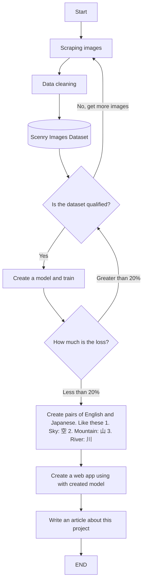

# Image Tagging Challenge
For workshop

BigData & AILab activity from Sep 29th 2021.

## To-do list
1. Create Fasteners and wire components dataset
2. Create Multi-label Image classification model whitch can add Japanese and English tags
3. Create a sample project to explain how to use created model
4. Write an article on note.com

## Dataset
We focus on fasteners and wire components.

I am the only one in charge of this project, so I'll save the dataset locally.

## About notebook
The lastest notebook about this project is on Google colab.

## Sample project
[scenery-tagging-app(GitHub)](https://github.com/ryu-i-engineer/scenery-tagging-app)

## Flowchart

